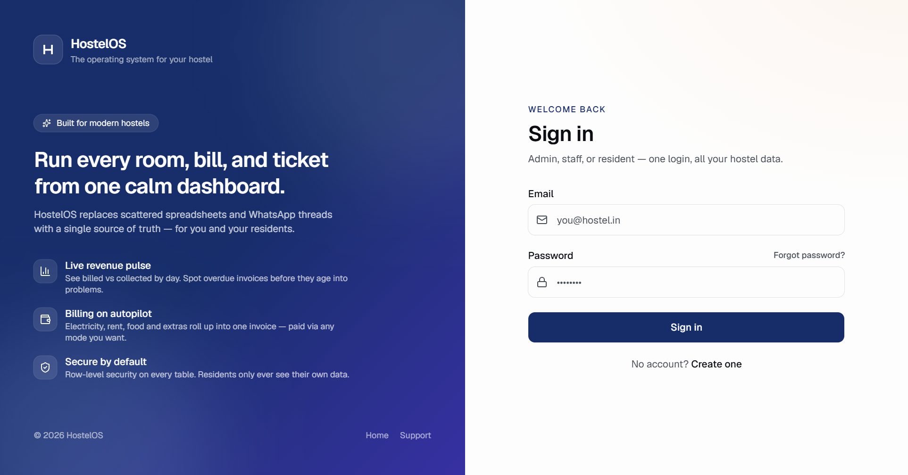

# Kalyan Reddy Kambala

 

  

&nbsp;

&nbsp;

&nbsp;

 

I build production AI tools and full-stack systems — end-to-end, from model to deploy. Currently undergraduate at **JAIN University**, focused on shipping real software to real users.

> **Now building:** [HostelOS](https://hostel-os-zeta.vercel.app/) — a multi-tenant SaaS for Indian hostel managers handling 100–1,000 residents per property. Live in production.

 

## Tech I work with

<table>
  <tr>
    <td><b>AI / ML</b></td>
    <td>
      
      
      
      
      
      
    </td>
  </tr>
  <tr>
    <td><b>Frontend</b></td>
    <td>
      
      
      
      
    </td>
  </tr>
  <tr>
    <td><b>Backend</b></td>
    <td>
      
      
      
      
    </td>
  </tr>
  <tr>
    <td><b>Data &amp; Cloud</b></td>
    <td>
      
      
      
      
      
      
    </td>
  </tr>
</table>

 

## Featured project · HostelOS

> **The operating system for your hostel.** A multi-tenant SaaS that replaces scattered spreadsheets and WhatsApp threads with a single source of truth — built for Indian PG / hostel managers handling 100–1,000 residents per property.

  
  &nbsp;
  

| What it does | How it works |
|---|---|
| Multi-tenant: one deployment, many hostels | Postgres row-level security isolates every table |
| Auto-billing with late fees & partial payments | Monthly invoices generated by `pg_cron` |
| One-tap UPI deep links via WhatsApp + email | Public claim form for UTR; admin confirms in one click |
| Self-service auth: OTP signup, password reset | Rate-limited 6-digit codes, role-based access |
| DPDP-compliant ID-proof handling | EXIF stripped on upload, auto-purge 6 months after checkout |
| Reports: occupancy, billing, payment-mix, SLA | Cron-driven aggregations, pulled into dashboard cards |

<b>Stack:</b> Next.js 14 · TypeScript · Supabase (Postgres + RLS + Edge Functions) · Tailwind · Sentry · Vercel

 

## Other projects

<table>
  <tr>
    <td width="50%" valign="top">
      <h4>🤟 <a href="https://github.com/kalyanreddy1486/Sign-Bridge_asl">Sign-Bridge ASL</a></h4>
      
Real-time American Sign Language recognition. Webcam → MediaPipe hand landmarks → CNN classifier → live text output.

      
Python · MediaPipe · OpenCV · TensorFlow

    </td>
    <td width="50%" valign="top">
      <h4>📄 <a href="https://github.com/kalyanreddy1486/Ai-resume-analyzer">AI Resume Analyzer</a></h4>
      
Parses resumes against a target job description, surfaces keyword gaps, and generates section-level recommendations.

      
Python · NLP · LLM APIs

    </td>
  </tr>
  <tr>
    <td width="50%" valign="top">
      <h4>📈 <a href="https://github.com/kalyanreddy1486/Revenue-Pulse">Revenue Pulse</a></h4>
      
Sales-analytics dashboard with KPI cards, trend charts, and drill-down views. Built for fast revenue insight at a glance.

      
TypeScript · Next.js · Tailwind

    </td>
    <td width="50%" valign="top">
      <h4>📊 <a href="https://github.com/kalyanreddy1486/Customer-churn-prediction">Customer Churn Prediction</a></h4>
      
End-to-end ML pipeline: behavioural feature engineering, gradient-boosted churn classifier, served behind a clean dashboard.

      
Python · scikit-learn · TypeScript

    </td>
  </tr>
  <tr>
    <td width="50%" valign="top">
      <h4>🪙 <a href="https://github.com/kalyanreddy1486/indian-stock-trading-bot">Indian Stock Trading Bot</a></h4>
      
Real-time analysis tool for Indian equities (NSE/BSE). Generates intraday and long-term signals from price + volume features.

      
TypeScript · Market-data APIs

    </td>
    <td width="50%" valign="top">
       
      
<a href="https://github.com/kalyanreddy1486?tab=repositories">→ See all repositories</a>

    </td>
  </tr>
</table>

 

## GitHub

  
  

<b>Contribution heatmap</b>

  

  <picture>
    <source media="(prefers-color-scheme: dark)" srcset="https://raw.githubusercontent.com/kalyanreddy1486/kalyanreddy1486/output/github-snake-dark.svg"/>
    <source media="(prefers-color-scheme: light)" srcset="https://raw.githubusercontent.com/kalyanreddy1486/kalyanreddy1486/output/github-snake.svg"/>
    
  </picture>

 

### Let's build something together

<a href="mailto:kalyanreddy895@gmail.com"><b>kalyanreddy895@gmail.com</b></a>  ·  <a href="https://www.linkedin.com/in/kalyan-reddy-kambala-9942092a4/"><b>LinkedIn</b></a>

Care about the model. Care about the deploy. Ship the whole thing.

